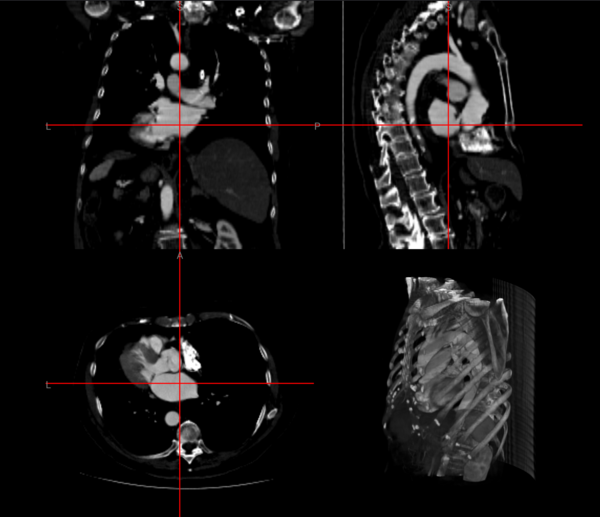

# itkwasm-loader

The itkwasm-loader is a [NiiVue](https://niivue.com/) plugin that converts [ITK-Wasm image IO-supported volumes]( https://docs.itk.org/projects/wasm/en/latest/introduction/file_formats/images.html) into NIfTI volumes and [ITK-Wasm mesh IO-supported meshes](https://docs.itk.org/projects/wasm/en/latest/introduction/file_formats/meshes.html) into MZ3 meshes. It uses the [@itk-wasm/image-io](https://www.npmjs.com/package/@itk-wasm/image-io) and [@itk-wasm/mesh-io](https://www.npmjs.com/package/@itk-wasm/mesh-io) libraries.




## Installation

```bash
npm install @niivue/itkwasm-loader
```

## Usage

### Quick Start

```javascript
import { Niivue } from '@niivue/niivue'
import { useItkWasmLoaders } from '@niivue/itkwasm-loader'

const nv = new Niivue()
await nv.attachToCanvas(document.getElementById('niivue-canvas'))

useItkWasmLoaders(nv)
```

This will add support for volume and mesh file formats not fully supported by default in NiiVue. To add support for all ITK-Wasm supported formats, call `useAllItkWasmLoaders` instead of `useItkWasmLoaders`.

### Custom Loaders

You can also create custom loaders for specific file formats using `createImageLoader` and `createMeshLoader`:

```javascript
import { Niivue } from '@niivue/niivue'
import { createImageLoader, createMeshLoader } from '@niivue/itkwasm-loader'

const nv = new Niivue()
await nv.attachToCanvas(document.getElementById('niivue-canvas'))

// Register a custom loader for TIFF images
nv.useLoader(createImageLoader('tif'), 'tif', 'nii')

// Register a custom loader for VTK meshes
nv.useLoader(createMeshLoader('vtk'), 'vtk', 'mz3')
```

This approach gives you fine-grained control over which formats to support and allows you to selectively register loaders for specific extensions.

See also the [NiiVue loader documentation](https://link-todo).

## Vite Configuration

If you are using Vite, you may need to add the following to your `vite.config.js`:

```javascript
import { defineConfig } from 'vite'

export default defineConfig({
  optimizeDeps: {
    exclude: ["itk-wasm", "@itk-wasm/mesh-io", "@itk-wasm/image-io", "@thewtex/zstddec"],
  },
});
```

## Local Browser Development

You can embed this loader into a hot-reloadable NiiVue web page to evaluate integration:

```
git clone git@github.com:niivue/itkwasm-loader.git
cd itkwasm-loader
npm install
npm run dev
```

## Alternative libraries

See also the [built-in NiiVue format support](https://niivue.com/docs/loading#supported-formats), [NiiVue ITK-Wasm cbor-loader](https://github.com/niivue/cbor-loader), which support ITK-Wasm's native CBOR format and in-memory [interface types](https://docs.itk.org/projects/wasm/en/latest/typescript/interface_types/index.html), [other NiiVue loaders and the NiiVue plugin documentation](https://niivue.com/docs/plugins).
